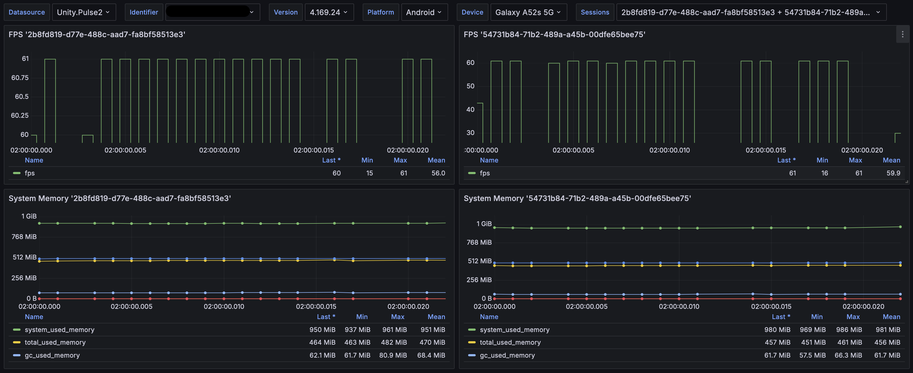

# UnityPulse

**Unity Continuous Benchmarking**

UnityPulse is a benchmarking tool designed to facilitate continuous performance testing for Unity projects. It enables developers to track performance metrics across different builds, ensuring that changes or updates in the project do not introduce unintended performance regressions.

## Features

- **Automated Benchmarking**: Automates the process of running performance tests across multiple builds.
- **Performance Tracking**: Tracks key performance metrics like frame rate, memory usage, and CPU utilization.
- **Comparison Across Builds**: Allows comparison of performance metrics between different builds to ensure optimal performance over time.
- **Lightweight Integration**: Easy to integrate into existing Unity projects with minimal setup.

## Getting Started

### Prerequisites

- Unity 2020 or higher
- Start and up back-end listeners on your server ([Server README](https://github.com/c1982/unitypulse/blob/main/src/Pulse.Server/README.md))


### Installation

0. Open Unity Packer Manager
1. Add package from git URL
2. Enter this URL:

    https://github.com/c1982/unitypulse.git?path=/src/Pulse.Unity/Assets/Scripts/Pulse   

### Usage

Pulse automatically initialized when unity starts. You can start and stop Pulse by calling `UnityPulse.Instance.Start` and `UnityPulse.Instance.Stop` respectively. You can also collect custom data by calling `UnityPulse.Instance.Collect` with a key and value pair.

Basic usage example:

```csharp
using Pulse.Unity;
using UnityEngine;

namespace Example
{
    public class ExampleController : MonoBehaviour
    {
        private readonly byte[] _updateTimeKeyName = System.Text.Encoding.ASCII.GetBytes("update_time");
        private long _updateTime;
        
        public void Awake()
        {
            // Initialize Pulse
            UnityPulse.Instance
                .SetDefaultLogger()
                .SetIdentifier(Application.identifier)
                .SetPlatform(Application.platform.ToString())
                .SetVersion(Application.version)
                .SetDevice(SystemInfo.deviceName)
                .SetSendBufferSize(1024)
                .SetErrorThreshold(5)
                .SetInterval(1f);
        }
        
        public void Start()
        {
            // Start Pulse
            UnityPulse.Instance.Start("127.0.0.1",7771);
        }
        
        public void Update()
        {
            // Collect Pulse data
            UnityPulse.Instance.Collect();
            
            // Collect custom data
            UnityPulse.Instance.Collect(_updateTimeKeyName, Random.Range(1,100));
        }
        
        public void OnDestroy()
        {
            UnityPulse.Instance.Stop();
        }
    }
}
```

### Collected Data

Pulse collects the following data:

#### Memory

- **System Used Memor**: The amount of memory used by the system.
- **System Total Memory**: The total amount of memory available to the system.
- **GC Used Memory**: The amount of memory used by the garbage collector.
- **Audio Used Memory**: The amount of memory used by the audio system.
- **Video Used Memory**: The amount of memory used by the video system.
- **Profiler Used Memory**: The amount of memory used by the profiler.

#### Render

- **SetPass Calls Count**: The number of set pass calls.
- **"Draw Calls Count"**: The number of draw calls.
- **"Total Batches Count"**: The total number of batches.
- **"Triangles Count"**: The number of triangles.
- **"Vertices Count"**: The number of vertices.
- **"Render Textures Count"**: The number of render textures.
- **"Render Textures Bytes"**: The amount of memory used by render textures.
- **"Render Textures Changes Count"**: The number of render texture changes.
- **"Used Buffers Count"**: The number of used buffers.
- **"Used Buffers Bytes"**: The amount of memory used by buffers.
- **"Used Shaders Count"**: The number of used shaders.
- **"Vertex Buffer Upload In Frame Count"**: The number of vertex buffer uploads.
- **"Vertex Buffer Upload In Frame Bytes"**: The amount of memory used by vertex buffer uploads.
- **"Index Buffer Upload In Frame Count"**: The number of index buffer uploads.
- **"Index Buffer Upload In Frame Bytes"**: The amount of memory used by index buffer uploads.
- **"Shadow Casters Count"**: The number of shadow casters.

### Grafana Dashboard

Pulse provides a Grafana dashboard to visualize the collected data. You can access the dashboard by navigating to `http://localhost:3000` in your browser and logging in with the default credentials:

- **Username**: pulse
- **Password**: admin

Simple comparison between two sessions:

